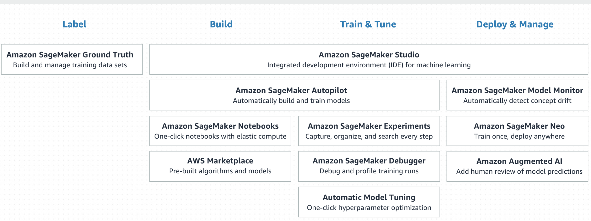

# AI services comparision between Amazon and Google

Jagadeesh Kandimalla, fa19-516-171 

<https://github.com/cloudmesh-community/fa19-516-171>

[Contributors](https://github.com/cloudmesh-community/fa19-516-171/graphs/contributors)

Update: Feb 3 2020

Analysis of the Cloud ML/AI offerings has been completed between AMAZON and GOOGLE.

# Amazon SageMaker

Amazon offers ML/AI offering through the service called SageMaker.

Amazon SageMaker Processing to analyze data and evaluate models on the Amazon SageMaker machine learning platform. 
Amazon SageMaker is a fully managed service that covers the entire machine learning workflow, from preparing your data,
to training and deploying the model to make predictions, and monitoring model performance when in production. 
Data processing tasks such as feature engineering, data validation, model evaluation, and model interpretation are 
essential steps performed by engineers and data scientists in this machine learning workflow. With Processing you 
can leverage a simplified, managed experience to run your data processing workloads on the Amazon SageMaker 
platform or by using the Amazon SageMaker APIs, in the experimentation phase and after code is deployed in production

SageMaker can be accessed as low-level client through boto3.The SageMaker API has lot 
of methods which can be used to built a ML algorithm from scratch.
The methods are available in below link

<https://boto3.amazonaws.com/v1/documentation/api/latest/reference/services/sagemaker.html>

The  below link is the example of SageMaker processing using SciKit_learn

<https://github.com/awslabs/amazon-sagemaker-examples/blob/master/sagemaker_processing/scikit_learn_data_processing_and_model_evaluation/scikit_learn_data_processing_and_model_evaluation.ipynb>

# Amazon SageMaker Services

# Amazon SageMaker Ground Truth

Amazon SageMaker Ground Truth helps you build highly accurate training datasets for machine learning quickly. SageMaker Ground Truth offers easy access to labelers through Amazon Mechanical Turk and provides them with built-in workflows and interfaces for common labeling tasks. You can also use your own labelers or use vendors recommended by Amazon through AWS Marketplace. 

# Amazon ML Services Other than SageMaker
        
# Amazon Comprehend
Amazon Comprehend is a natural language processing (NLP) service that uses machine learning to find insights and relationships in text. No machine learning experience required.
# Amazon Forecast  
Amazon Forecast is a fully managed service that uses machine learning to deliver highly accurate forecasts.
# Amazon Fraud Detector   
Amazon Fraud Detector is a fully managed service that makes it easy to identify potentially fraudulent online activities such as online payment fraud and the creation of fake accounts.
# Amazon Kendra 
Amazon Kendra is a highly accurate and easy to use enterprise search service that’s powered by machine learning. Kendra delivers powerful natural language search capabilities to your websites and applications so your end users can more easily find the information they need within the vast amount of content spread across your company
# Amazon Lex 
Amazon Lex is a service for building conversational interfaces into any application using voice and text. Amazon Lex provides the advanced deep learning functionalities of automatic speech recognition (ASR) for converting speech to text, and natural language understanding (NLU) to recognize the intent of the text, to enable you to build applications with highly engaging user experiences and lifelike conversational interactions. 
# Amazon Personalize       
Amazon Personalize is a machine learning service that makes it easy for developers to create individualized recommendations for customers using their applications.
# Amazon Polly 
Amazon Polly is a service that turns text into lifelike speech, allowing you to create applications that talk, and build entirely new categories of speech-enabled products. Polly's Text-to-Speech (TTS) service uses advanced deep learning technologies to synthesize natural sounding human speech. 
# Amazon Rekognition 
Amazon Rekognition makes it easy to add image and video analysis to your applications using proven, highly scalable, deep learning technology that requires no machine learning expertise to use. With Amazon Rekognition, you can identify objects, people, text, scenes, and activities in images and videos, as well as detect any inappropriate content. 
# Amazon Textract 
Amazon Textract is a service that automatically extracts text and data from scanned documents. Amazon Textract goes beyond simple optical character recognition (OCR) to also identify the contents of fields in forms and information stored in tables.
# Amazon Transcribe  
Amazon Transcribe makes it easy for developers to add speech-to-text capability to their applications. Audio data is virtually impossible for computers to search and analyze. Therefore, recorded speech needs to be converted to text before it can be used in applications.
# Amazon Translate 
Amazon Translate is a neural machine translation service that delivers fast, high-quality, and affordable language translation. Neural machine translation is a form of language translation automation that uses deep learning models to deliver more accurate and more natural sounding translation than traditional statistical and rule-based translation algorithms.
# AWS DeepLens     
The AWS Deep Learning AMIs provide machine learning practitioners and researchers with the infrastructure and tools to accelerate deep learning in the cloud, at any scale. You can quickly launch Amazon EC2 instances pre-installed with popular deep learning frameworks and interfaces such as TensorFlow, PyTorch, Apache MXNet, Chainer, Gluon, Horovod, and Keras to train sophisticated, custom AI models, experiment with new algorithms, or to learn new skills and techniques
# AWS DeepRacer  
AWS DeepRacer gives you an interesting and fun way to get started with reinforcement learning (RL). RL is an advanced machine learning (ML) technique that takes a very different approach to training models than other machine learning methods. Its super power is that it learns very complex behaviors without requiring any labeled training data, and can make short term decisions while optimizing for a longer term goal
# Amazon Augmented AI    
Amazon Augmented AI (Amazon A2I) makes it easy to build the workflows required for human review of ML predictions. Amazon A2I brings human review to all developers, removing the undifferentiated heavy lifting associated with building human review systems or managing large numbers of human reviewers.

# Google Cloud AI Hub

Cloud AutoML makes the power of machine learning available to you even if you have limited knowledge of 
machine learning. You can use AutoML to build on Google's machine learning capabilities to create your own custom 
machine learning models that are tailored to your business needs, and then integrate those models into your
applications and web sites.

pip install google-cloud-automl

Service: automl.googleapis.com

We recommend that you call this service using Google-provided client libraries. If your application needs to
call this service using your own libraries, you should use the following information when making the API requests.

Google API 

<https://googleapis.dev/python/automl/latest/gapic/v1beta1/tables.html>

Here is the github link for Python version of CloudAutoml.

<https://github.com/googleapis/python-automl>

# Comparision between Amazon and Google features.

| Feature                            |  Amazon      | Google     |
| :----------------------------------| :----------: | -----------: |
| Notebook environment               | Yes          |       Yes    |
| Train custom learning algorithms   | Yes          |       Yes    |
| Deploy custom learning algorithms  | Yes          |       No     |
| Automatic hyperparameter tuning    | Yes          | Only for TensorFlow models|
| Distributed training	             | Yes          | Only for TensorFlow models|
